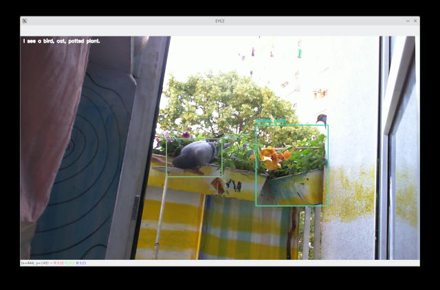

# EYEZ
Simple python application to recognize objects via camera. Done as an vision module for [AI project llama-assistant](https://github.com/w84death/llama-assistant).



## Quick Start
```
$ git clone https://github.com/w84death/eyez.git
$ cd eyez
$ python3 -m venv venv
$ source venv/bin/activate
$ pip install opencv-python opencv-contrib-python cvlib tensorflow
$ python3 eyez.py
```
